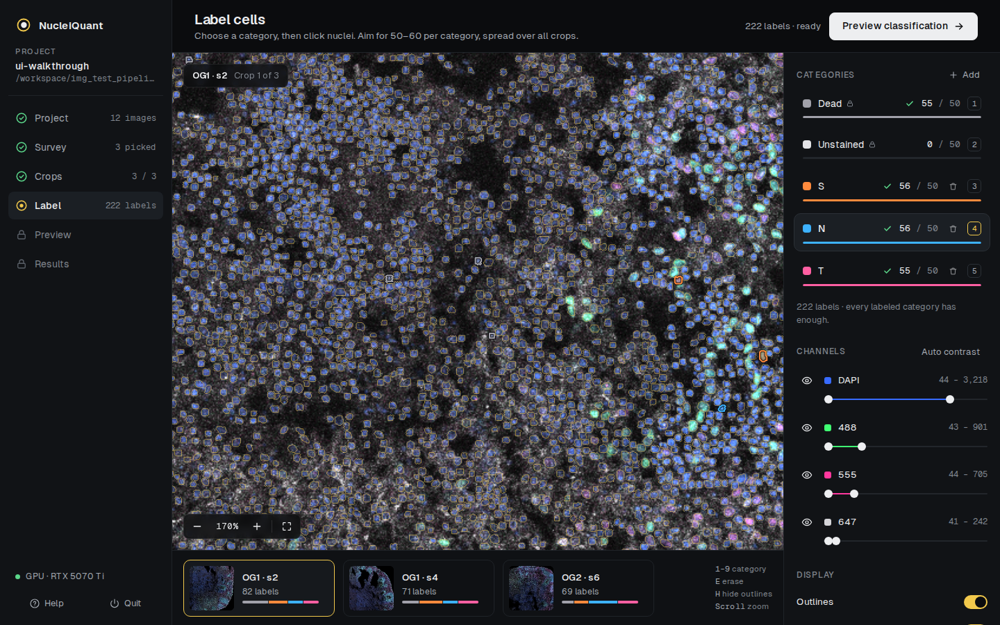
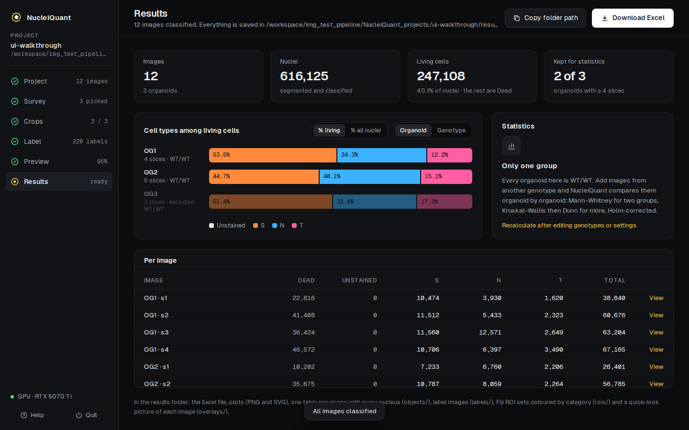

# NucleiQuant

**Count cell types in fluorescence images.** NucleiQuant finds every nucleus in your
images, learns your cell types from a few examples you click, classifies every cell and
gives you the counts, proportions and statistics in an Excel file — all in one app, with
no programming.



It is built for immunostained tissue sections (organoids, brain slices…) with a nuclear
stain (e.g. DAPI) and 1–4 markers, and uses **stardist_haug2**, a StarDist model
fine-tuned for dense tissue ([Pigeon et al., 2025](https://doi.org/10.1101/2025.10.27.684791)).

---

## Install (once)

1. **Install Docker Desktop** — free: <https://www.docker.com/products/docker-desktop/>.
   Start it once and wait until it says it is running.
   - *Linux*: Docker Engine works too. For GPU speed, also install the
     [NVIDIA Container Toolkit](https://docs.nvidia.com/datacenter/cloud-native/container-toolkit/latest/install-guide.html).
   - *Windows*: an NVIDIA GPU is used automatically with a recent NVIDIA driver.
   - *Mac* and computers without an NVIDIA card: everything runs on the processor, a bit
     slower (about 20 s to 1 min per image instead of ~15 s).
2. **Download NucleiQuant**: on GitHub, click **Code › Download ZIP**, then unzip it
   somewhere you'll find it again (e.g. Documents).

About 30 GB of free disk space is needed. Nothing else to install.

## Start

| Computer | Double-click |
|---|---|
| Windows | `Start NucleiQuant.bat` |
| Mac | `Start NucleiQuant.command` (the first time: right-click › Open, then Open) |
| Linux | `start-nucleiquant.sh` (or run it in a terminal) |

The **first start prepares the app** (a one-time download of about 10 GB, 10–30 minutes).
After that it opens in a few seconds, in your web browser, at <http://localhost:8765>.
Everything stays on your computer: nothing is uploaded anywhere.

To stop, click **Quit** in the app.

> The Windows and Mac launchers are new: if one doesn't work on your computer, please
> [open an issue](https://github.com/Julien-Pgn/NucleiQuant/issues) with what the window says.

## Your images

- **TIFF files**, one per image, all channels in the same file (e.g. DAPI, 488, 555, 647).
  2D only: project z-stacks first (Fiji: *Image › Stacks › Z Project*). Other formats
  (CZI, ND2, LIF) can be converted with Fiji (*File › Save As › Tiff*).
- All images of an experiment in **one folder**, acquired with the same settings.
- **Experiment details in the file names**, parts separated by `_`. The default pattern is
  `clone_diff_day_immuno_objective_imaging_organoid_slice`, e.g.
  `Pa_dQ_J70_SNd2T_20Xa_g1dt08_OG1_s1.tif`. You can describe your own pattern in the app;
  include `organoid` and `slice` to add up slices per organoid, and `clone` to group clones
  by genotype.

NucleiQuant never changes your images. Results go into a `NucleiQuant_projects` folder
inside your images folder.

## How it works: six steps

| | Step | What you do | Time |
|---|---|---|---|
| 1 | **Project** | Pick the images folder, name the channels, choose the nuclear channel, type each clone's genotype. | 1 min |
| 2 | **Survey** | Every image is measured. Three training images per clone are picked for you — dim, typical and bright staining — so the classifier copes with staining variation. | seconds |
| 3 | **Crops** | A region of each training image is cut and its nuclei are found. Drag a frame to move it. | 1 min |
| 4 | **Label** | Create your categories (e.g. SATB2+, TBR1+). *Dead* and *Unstained* are always there. Click 50–60 nuclei per category, spread over all crops. | 15–30 min |
| 5 | **Preview** | Every nucleus is coloured by its predicted type, with the accuracy on crops the classifier didn't train on. Correct mistakes, retrain, validate. | 5 min |
| 6 | **Results** | All images are classified. You get the Excel file, plots and statistics, and can inspect any image. | 15 s – 1 min per image |

The full, illustrated walkthrough is in the **[user guide](docs/user_guide.md)** (also
available from the **Help** button in the app).



## What you get

In `<images>/NucleiQuant_projects/<project>/results/`:

| File | Content |
|---|---|
| `<experiment>_counts.xlsx` | Counts per image, per organoid (slices added up), per organoid with ≥ 4 slices, proportions (% of all nuclei and % of living cells), statistics, classifier summary, settings |
| `plots/` | Proportion plots (PNG and SVG, ready for figures) |
| `objects/` | One table per image: every nucleus, its position, size, category and probabilities |
| `rois/` | Fiji ROI sets, one polygon per nucleus, named and coloured by category (open in Fiji's ROI Manager) |
| `labels/` | Nucleus label images (`.tif` and `.h5`) |
| `overlays/` | A quick-look picture of each image with coloured outlines |

**Statistics**: per organoid (never per cell), Mann-Whitney for two groups, Kruskal-Wallis
then Dunn's test for more, Holm-corrected. The raw counts are in the Excel file for any
other analysis (e.g. mixed models in R).

## Is it accurate?

Checked on the 12 test images in `img_test_pipeline/` (human cortical organoids, ~600,000
nuclei):

- **Segmentation** reproduces the published model's output (38,840 vs 38,841 nuclei on one image).
- **Measurements** are identical to ilastik's (mean intensities match to 0.0001).
- **Classification**: trained on 55 cells per category, the classifier is right **93–95 %**
  of the time on a crop it never saw, and agrees with the published ilastik classification
  for **94 %** of nuclei (Cohen's κ = 0.89).

Each nucleus is described by ~300 measurements (shape, intensity statistics in each channel,
texture, the surrounding ring as in ilastik, the perinuclear region, channel correlations,
intensities relative to the whole image), and a random forest — the same algorithm as
ilastik — learns your categories from them.

## Troubleshooting

| Problem | Solution |
|---|---|
| "Docker is not installed / not running" | Install or start Docker Desktop, wait until it's ready, start NucleiQuant again. |
| The first start takes long | It downloads ~10 GB once. Later starts take seconds. |
| "CPU mode" in the sidebar | No usable NVIDIA GPU: everything still works, a little slower. On Linux, the NVIDIA Container Toolkit lets Docker use the GPU. |
| My folder isn't listed | The app can open your home folder and external drives. Move the images there. |
| "names don't match the pattern" | Click **Edit pattern** on the Project screen and describe your file names. |
| Browser shows "can't reach" | NucleiQuant was stopped: start it again. The project reopens where you left it. |
| The Mac says the file can't be opened | Right-click `Start NucleiQuant.command` › Open › Open (only the first time). |
| NucleiQuant runs on another computer (e.g. a lab GPU workstation you reach over SSH) | The link only works on that computer. Forward port 8765 to yours: in VS Code, **PORTS** tab › Forward a Port › `8765`; or in a terminal on your computer, `ssh -N -L 8765:127.0.0.1:8765 you@workstation`. Then open <http://localhost:8765>. |

## Limits

2D images only; nuclei only (cytoplasmic markers are captured around each nucleus, not
by whole-cell segmentation); one category per cell (make a "S+T" category for double
positives); a classifier is specific to one staining panel, magnification and imaging
setup. The model was tuned on DAPI in human cortical organoids at 20× — check the
segmentation on other tissues. See [AGENTS.md](AGENTS.md) for the complete list and how
each limit could be lifted.

## For developers and AI coding assistants

The project is designed to be adapted with Claude Code, Codex or similar tools:
[AGENTS.md](AGENTS.md) explains the architecture, the rules that must not be broken, and
step-by-step recipes (another file naming scheme, more channels, new measurements, another
segmentation model, new statistics…).

```bash
./run_container.sh build     # build the image
./run_container.sh app       # run the app from the source tree
./run_container.sh test      # tests
```

---

## Legacy workflow (V1): StarDist + ilastik

The V1 pipeline used in Pigeon et al. is still available:

1. **Segment** with `./run_container.sh exec python scripts/01_segmentation.py --images <folder>`
   (writes `lbl/` label images as `.tif` and `.h5`, and `roi/` ImageJ ROIs).
2. **Select training images** and crop them with `notebooks/02_image_selection.ipynb`
   (`./run_container.sh jupyter`, then <http://localhost:8888>).
3. **Train an ilastik object classifier** (*Object Classification*, inputs: raw data +
   segmentation) on the crops, with a *Dead* and an *Unstained* category plus your own;
   batch-process all images and export the tables as CSV. An example project is in
   `nuclei_quant_example.ilp.zip`.
4. **Aggregate** the CSV files with `notebooks/03_quantifications.ipynb` (Excel output per
   slice and per organoid).

The model can also be used outside NucleiQuant: `models/stardist_haug2` (Python),
`TF_SavedModel.zip` (Fiji, TensorFlow 1.15), `qupath_export/stardist_haug2.pb`
([QuPath StarDist extension](https://qupath.readthedocs.io/en/stable/docs/deep/stardist.html)).
`notebooks/00_training.ipynb` fine-tunes StarDist on your own annotations
(134 annotated organoid images and 447 DSB2018 images are in `data/`).

## Citation

If you use NucleiQuant or the stardist_haug2 model, please cite:

> **Pigeon J.**, et al. Post-translational Tuning of Human Cortical Progenitor Neuronal
> output. bioRxiv (2025). <https://doi.org/10.1101/2025.10.27.684791>

and the tools it builds on: [StarDist](https://github.com/stardist/stardist)
(Schmidt et al., MICCAI 2018; Weigert et al., WACV 2020) and, for the V1 workflow,
[ilastik](https://www.ilastik.org) (Berg et al., Nature Methods 2019).

The pipeline was assembled by Julien Pigeon in the Hassan Lab at the Paris Brain Institute.
Code under the license in `LICENSE`; the Geist fonts are under the SIL Open Font License.
