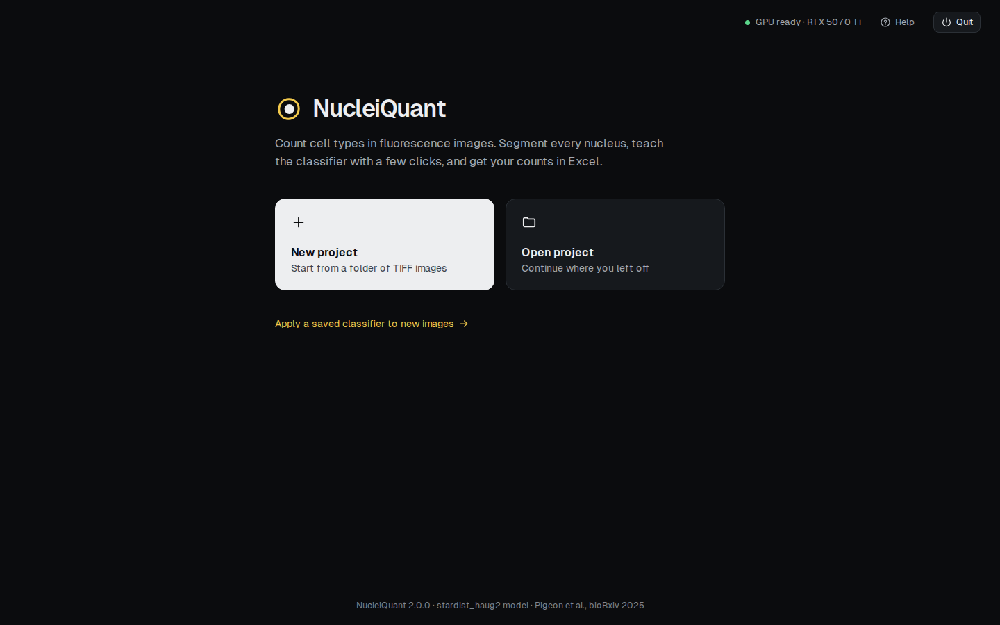
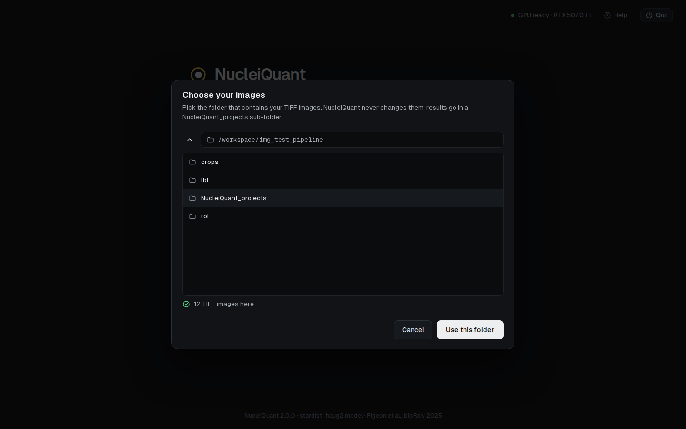
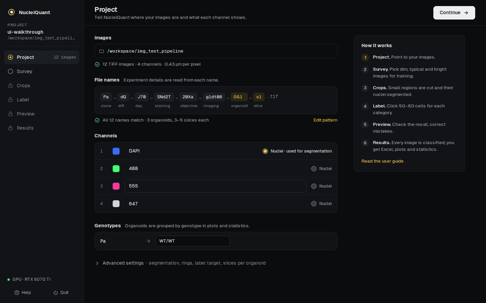
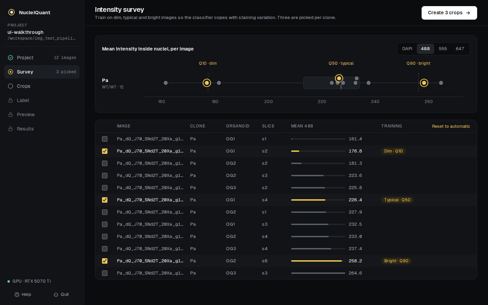
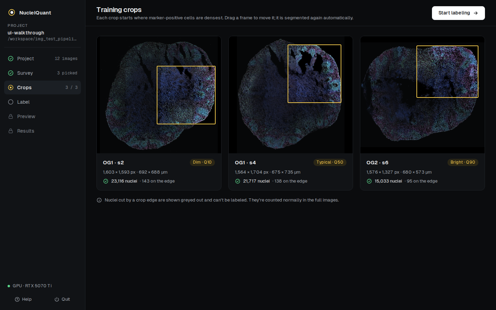
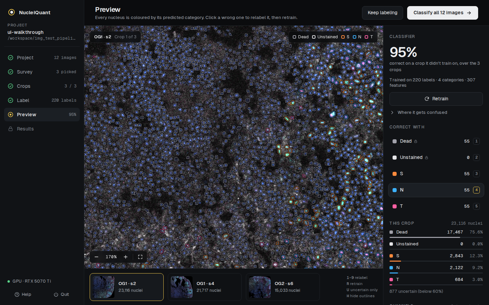
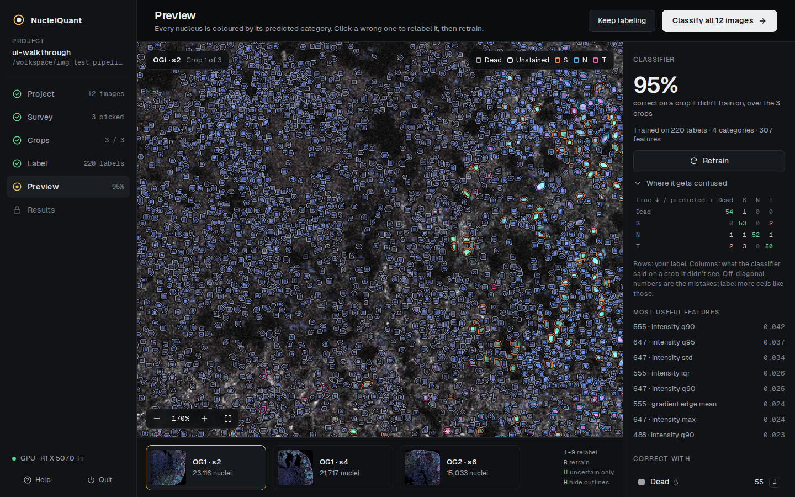
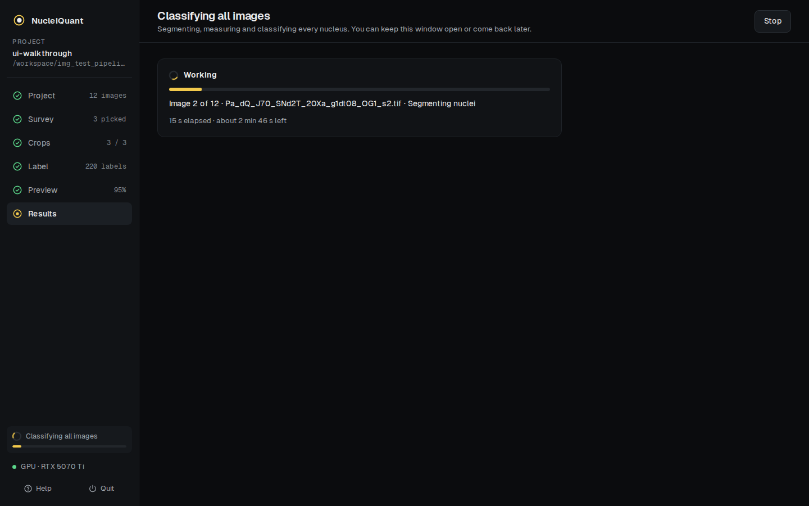
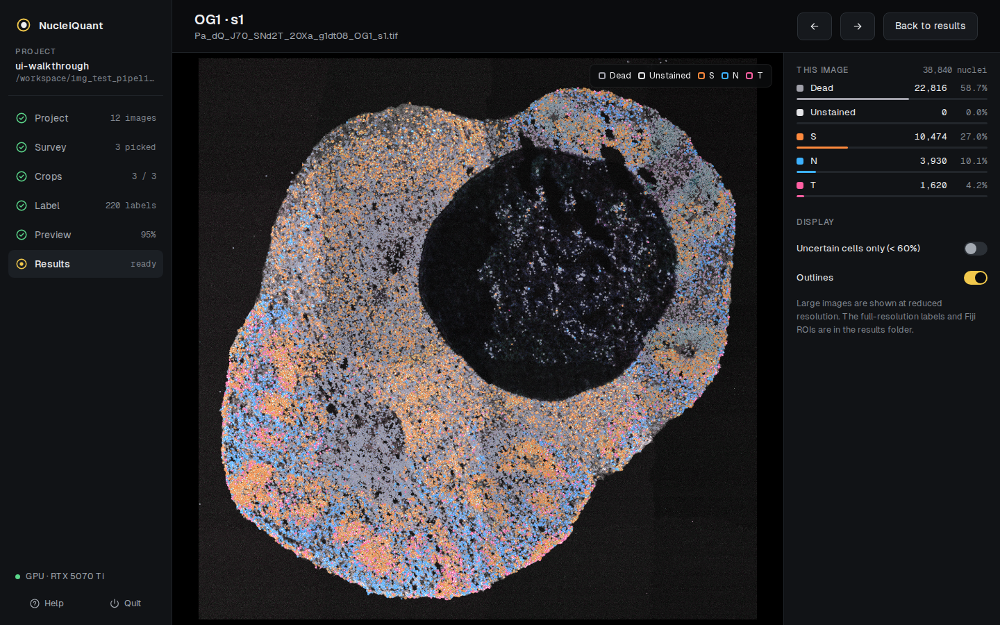

# NucleiQuant user guide

NucleiQuant counts cell types in fluorescence images in six steps. You go through them
once per experiment; everything is saved as you go, so you can quit and come back at any
step.

- [Before you start](#before-you-start)
- [1. Project](#1-project)
- [2. Survey](#2-survey)
- [3. Crops](#3-crops)
- [4. Label](#4-label)
- [5. Preview](#5-preview)
- [6. Results](#6-results)
- [Reusing a classifier](#reusing-a-classifier)
- [Settings](#settings)
- [Questions](#questions)

## Before you start

**Images.** One TIFF file per image, with all channels in the file, 2D (project z-stacks
first). Put all images of the experiment in one folder. They should come from the same
staining and the same microscope settings: a classifier learns intensities, so it is only
valid for one imaging setup.

**File names carry the experiment details**, parts separated by `_`. The default pattern
is:

```
clone_diff_day_immuno_objective_imaging_organoid_slice
Pa_dQ_J70_SNd2T_20Xa_g1dt08_OG1_s1.tif
```

You can describe any other pattern (see [Project](#1-project)). Three names matter:
`clone` (to group clones by genotype), `organoid` and `slice` (to add up the slices of each
organoid). Without `organoid`, each image counts as one sample.

**Starting the app**: double-click `Start NucleiQuant.bat` (Windows),
`Start NucleiQuant.command` (Mac) or `start-nucleiquant.sh` (Linux). Your browser opens
on the home screen.



Click **New project**, choose your images folder and give the project a name. You can make
several projects on the same images (e.g. one per staining panel).



## 1. Project



- **Images**: the folder, the number of images and channels, and the pixel size read from
  the files.
- **File names**: an example file name cut into its parts. If some names don't match, click
  **Edit pattern** and type the names of the parts in order, separated by `_`
  (e.g. `clone_day_organoid_slice`).
- **Channels**: name each channel (e.g. DAPI, SATB2, TBR1, CTIP2) and choose its display
  colour by clicking the square. Tick **Nuclei** on the nuclear stain: nuclei are found on
  that channel.
- **Genotypes**: type the genotype of each clone (e.g. WT/WT, KO/KO). Groups in plots and
  statistics use these. You can change them later and recalculate the results.

Click **Continue**.

## 2. Survey



Staining brightness varies between organoids and slices. A classifier trained only on
bright images makes mistakes on dim ones, so NucleiQuant measures every image (mean
intensity inside the nuclei, estimated without segmenting) and picks three training images
per clone: the ones closest to the **10th (dim), 50th (typical) and 90th (bright)
percentile** of the chosen channel.

- Choose the channel of your main marker with the buttons above the plot.
- Each dot is an image; yellow rings are the images picked for training. Click a dot or a
  row to add or remove an image. **Reset to automatic** restores the picks.
- More training images mean more variety to learn from, but more to label.

Click **Create crops**.

## 3. Crops



A region of each training image (a quarter of the image by default) is cut and its nuclei
are found with the stardist_haug2 model. The region starts where marker-positive cells are
densest, so each crop contains positive cells, negative cells and some dead cells.

- **Drag the yellow frame** to move a crop; it is segmented again (its labels, if any, are
  removed).
- Nuclei touching the edge of a crop are cut in two: you'll see them greyed out and can't
  label them. They are counted normally in the full images.

Click **Start labeling** when all crops are ready.

## 4. Label


This is where you teach NucleiQuant your cell types.

**Categories.** *Dead* and *Unstained* are always there. Click **Add** to create your own
categories (e.g. `SATB2+`, `TBR1+`). A cell gets exactly one category, so if cells can
carry two markers and you want to count them, make a category for them (e.g.
`SATB2+TBR1+`). Double-click a name to rename it, click its colour square to change it.

**Labeling.** Select a category (click it, or press its number key **1–9**), then click
nuclei in the image.

| Action | How |
|---|---|
| Label a nucleus | click it |
| Remove a label | right-click it, or click it again with the same category, or press **E** (erase mode) and click |
| Zoom | mouse wheel, or the – / + buttons; **F** fits the image |
| Move around | drag the image |
| See the image without outlines | hold **H** |
| Next / previous crop | **]** / **[**, or click in the strip below the image |

**Channels.** The eye shows or hides a channel; the slider sets its contrast (like ImageJ's
Brightness & Contrast). **Auto contrast** resets. These settings only change the display,
never the measurements.

**How many labels?** At least 50 per category (the counters turn green), ideally spread
over all crops, and including a few hard cases (dim positives, bright negatives). Label
cells you are sure about; skip the ones you can't decide on. A category you don't use at
all (e.g. no unstained cells in your staining) can stay empty: NucleiQuant warns you, and the
classifier simply never predicts it.

Click **Preview classification**.

## 5. Preview



The classifier (a random forest, the same method as ilastik) is trained on your labels and
every nucleus of every crop is outlined in the colour of its predicted category.

- **The percentage** is how often the classifier is right on a crop it did *not* train on
  (it is trained on the other crops, tested on this one, for each crop in turn). Above
  90 % is typical for clear stainings.
- **Where it gets confused** shows which categories are mixed up (rows: your label;
  columns: the prediction) and which measurements the classifier relies on most.



- **Uncertain cells only** (key **U**) shows only nuclei the classifier isn't sure about
  (probability below 60 %). These are the best ones to label next.
- To **correct** a mistake: select the right category (keys 1–9) and click the nucleus. Then
  click **Retrain** (key **R**); the colours update.

When the preview looks right, click **Classify all images**.

## 6. Results



Every image is now segmented, measured and classified — about 15 seconds per image on a
recent workstation, up to a minute on a laptop. You can **Stop** at any time; images already done are kept,
and starting again continues where it stopped. If you retrain the classifier later,
classifying again reuses the segmentations and is faster.


- **Tiles**: number of images, nuclei, living cells (all except *Dead*) and organoids kept
  for statistics (at least 4 slices by default, as in Pigeon et al.).
- **Proportions**: each category as a percentage of living cells (or of all nuclei), per
  organoid or averaged per genotype. Greyed bars are organoids excluded for having too few
  slices.
- **Statistics**: see below.
- **Per image**: counts per image. **View** opens the image with every nucleus outlined in
  its category colour, to check the result anywhere.



**Download Excel** saves the workbook. **Copy folder path** gives you the results folder.

### The Excel file

| Sheet | Content |
|---|---|
| `per_image` | one row per image: the parts of its file name, genotype, number of nuclei per category, Total, Living (= Total − Dead) |
| `per_organoid` | the slices of each organoid added up, with the number of slices |
| `per_organoid_curated` | only organoids with at least the minimum number of slices |
| `proportions` | per kept organoid: each category as % of all nuclei and as % of living cells |
| `statistics` | group comparisons (see below) |
| `classifier` | labels per category, accuracy on unseen crops, recall per category, most important measurements |
| `settings` | everything needed to reproduce the analysis (channels, pattern, segmentation settings, version) |

### The results folder

| Folder | Content |
|---|---|
| `objects/` | one CSV per image, one row per nucleus: position, area, category, probability of each category, mean intensity per channel |
| `rois/` | Fiji ROI sets: open the image in Fiji, then the zip in the ROI Manager. Each nucleus is named and coloured by its category |
| `labels/` | nucleus label images (`.tif` and `.h5`), as in V1 |
| `overlays/` | quick-look pictures with coloured outlines |
| `plots/` | proportion plots in PNG and SVG (editable in Illustrator/Inkscape) |

### Statistics

Cells from the same organoid are not independent, so comparisons use **one value per
organoid** (its proportion), never individual cells.

- Two groups (e.g. WT vs KO): **Mann-Whitney U** test.
- Three or more: **Kruskal-Wallis**, then **Dunn's** test for each pair.
- p-values are **Holm-corrected** for the number of categories tested (and of pairs).
- Groups are genotypes (or clones, see Settings). With fewer than 3 organoids in a group,
  the test can't reach significance; NucleiQuant warns you.

These tests make no assumption about the distribution. They don't model that clones of the
same genotype are related; for that (mixed models), use the counts in the Excel file in R.

## Reusing a classifier

For a new experiment with the **same staining and imaging settings**, you don't need to
label again: on the home screen, click **Apply a saved classifier to new images**, choose
the new images folder and the project whose classifier to reuse. You go straight to
Results. Check a few images with **View**: if staining or imaging changed, train a new
classifier.

## Settings

**Project › Advanced settings**:

| Setting | Default | Meaning |
|---|---|---|
| Labels per category | 50 | labels needed per category before the preview |
| Min. slices per organoid | 4 | organoids with fewer slices are left out of proportions and statistics |
| Compare groups by | Genotype | or Clone |
| Crop size | 50 % | crop side as a percentage of the image side |
| Neighbourhood ring | 30 px | ring around each nucleus measured for context (as ilastik's "neighborhood") |
| Perinuclear ring | 4 px | background just around the nucleus (cytoplasmic signal) |
| Trees in the forest | 100 | as in ilastik |
| "Uncertain" below | 0.6 | probability below which a nucleus counts as uncertain |
| Segmentation percentiles | 0.2 – 99.8 | brightness range used to normalise the nuclear channel before segmentation |
| Save every feature | off | also save all ~300 measurements of every nucleus (large files) |

Changing segmentation or measurement settings after the crops were made re-creates the
crops and removes their labels.

## Questions

**How long does it take?** Setting up and labeling: 30–60 minutes. Classifying: 15 s to
1 min per image depending on the computer (an NVIDIA GPU helps but isn't needed).

**What does the classifier look at?** About 300 measurements per nucleus: size and shape;
intensity statistics in each channel (mean, percentiles, spread…); intensity relative to
the whole image (so dim and bright images are comparable); the core versus rim of the
nucleus; a 30-pixel ring around it and the thin perinuclear region (for cytoplasmic
signal); correlations between channels; texture; and how crowded the neighbourhood is. It
does *not* use where the nucleus is in the image.

**Can it do cytoplasmic or membrane markers?** Partly: the rings around each nucleus capture
nearby signal, which often works. There is no whole-cell segmentation.

**My images are not organoids.** Any tissue works if the nuclei look like the training data
(dense tissue, DAPI, 20×). Always check the segmentation on the Crops and Label screens.

**Where are my projects?** In `NucleiQuant_projects` inside your images folder. The home
screen lists recent projects; **Open project** opens any of them.

**NucleiQuant runs on a lab workstation and I work from my laptop.** Start it on the
workstation, then forward port 8765 to your laptop: in VS Code (Remote-SSH), open the
**PORTS** tab › Forward a Port › `8765`; or run `ssh -N -L 8765:127.0.0.1:8765 you@workstation`
on your laptop. Then open <http://localhost:8765> on your laptop. The images stay on the
workstation.

**Nothing happens / the page says it can't reach NucleiQuant.** The app was stopped. Start it
again with the launcher; your project reopens where you left it.
